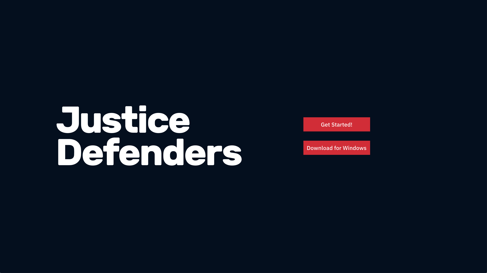

# Justice Defenders

[Justice Defenders](https://www.justice-defenders.org/) custom platform to facilitate access to legal training to prison inmates and guards in Kenya and Uganda to provide legal services for themselves and others.

See it [live](https://justice-defenders.netlify.app/#/).

## Installation

- Navigate to [repo](https://github.com/tech-for-better/justice-defenders)
- Clone it with `git clone https://github.com/tech-for-better/justice-defenders.git` and `cd` into the project folder
- `npm i` to install all dependencies
- use `npm run start` to start the server in the browser or `npm run dev` to start the server both in the browser and Electron.

### Tests

- End-to-end test done with Cypress, covering over 95% of the codebase.
- Use script `npm run cy:open` to run the specs.

## Tech used

- React
- Firebase storage and cloud NoSQL database
- Electron for desktop app
- Cypress

## Admin

Project duration: 27th July to 27th August 2020.

- Design week: ideation to prototyping and first round of usability testing.
- Two 6-day build sprints:
  - first focused on building the database and skeleton of the platform.
  - second focused on packaging and distributing desktop app, adding extra pages, end-to-end tests, styling, enhancing the user experience and final usability testing.

## Design process

- Problem statement:
- Dicovery and definition workshops done using [Miro board](https://miro.com/app/board/o9J_ko8RJ7E=/).
- Prototype on Figma available [here](https://www.figma.com/file/7Uf0JhDeX4bJs4OnC1xcqL/Justice-Defenders?node-id=0%3A1).

### User stories

**Acceptance criteria**

- [x] As a user I can see what module and subtopic I am currently on
- [x] As a user I can navigate to the sections of the app from any page
- [x] As a user I can easily find help to use the platform
- [x] As a user I can download relevant material and interact with it offline
- [x] As an admin user I can modify content displaied on the website
- [x] As a admin user I can add new modules/subtopics and media content to the website.

**Nice-to-haves: user features**

- [ ] As a user I can login/sign up
- [ ] As a user I can have a quick overview and keep track of my progress
- [ ] As a user I can mark things as completed
- [ ] As a user I can interact and collaborate with others
- [ ] As a user I can fill out assessment questions
- [ ] As a user I can take notes in relation to papers, videos and consult my notes at any time

### Usability testing

- Carried out at the end of design week With prototype and again at the end of the project with final product with 2 users in Kenya
- Tasks asked requested:
  1. Can you navigate to Year 1, Tort Law, Informed Consent?
  2. Can you open some readings?
  3. Can you listen to some audio?
  4. Can you tell us where you are in the app?
  5. If you were stuck or lost what would you do?
  6. Finally, can you navigate home?
- Feedback overall very positive in regards to navitation and emphasis on making the content available offline.

## Future development

- Making the content available offline in the desktop app using database NeDB. Some useful resouces:
  - [Local Data storage for Electron](https://dev.to/ctxhou/local-data-storage-for-electron-2h4p)
  - [How to store user data in Electron](https://medium.com/cameron-nokes/how-to-store-user-data-in-electron-3ba6bf66bc1e)
- Certification to proper distribution of the app. This has budget implecations.
- Authentication and user features listed in the user stories above.

## Developers

- Campbel Docherty [/CampbellDocherty](https://github.com/CampbellDocherty)
- Giovanna Aveiro [/glrta](https://github.com/glrta)
- Contribution from Anthony Lomax [/tonylomax](https://github.com/tonylomax)

Any issues or bugs, please contact the developers.

---

Hosted on GitHub, deployed to Netlify and Electron.
